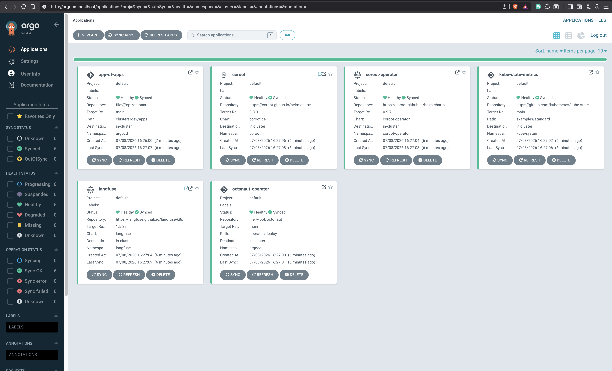
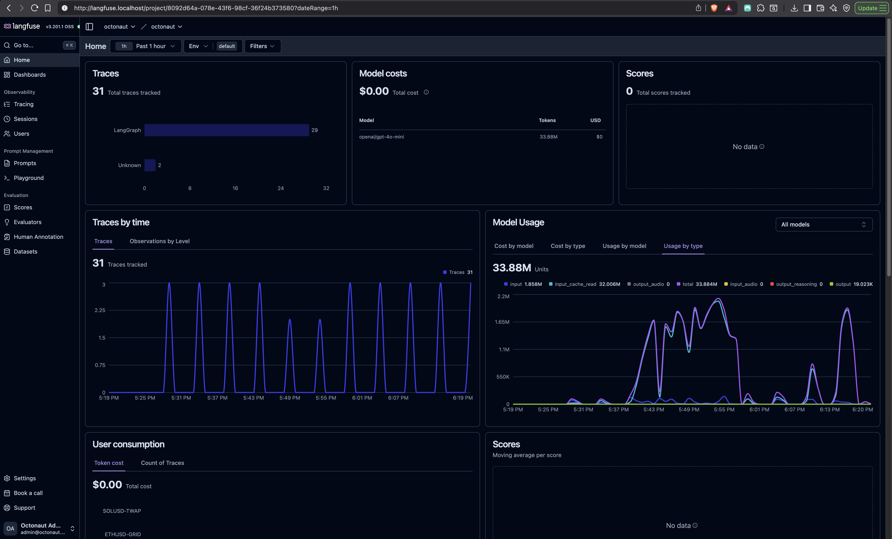
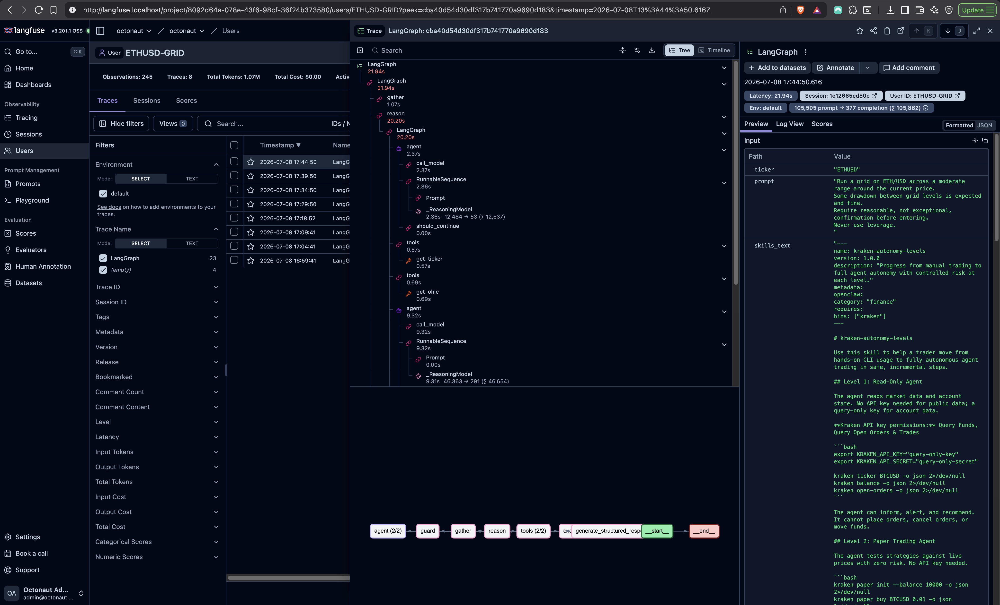
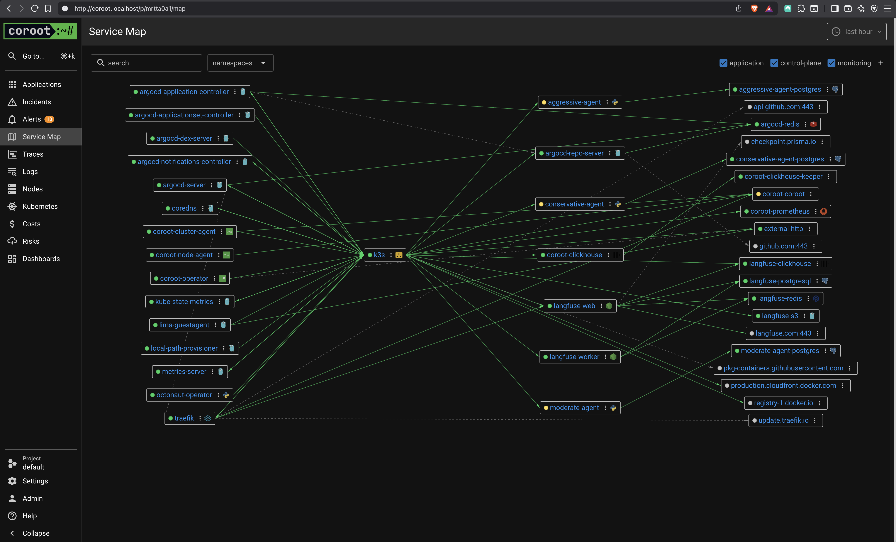
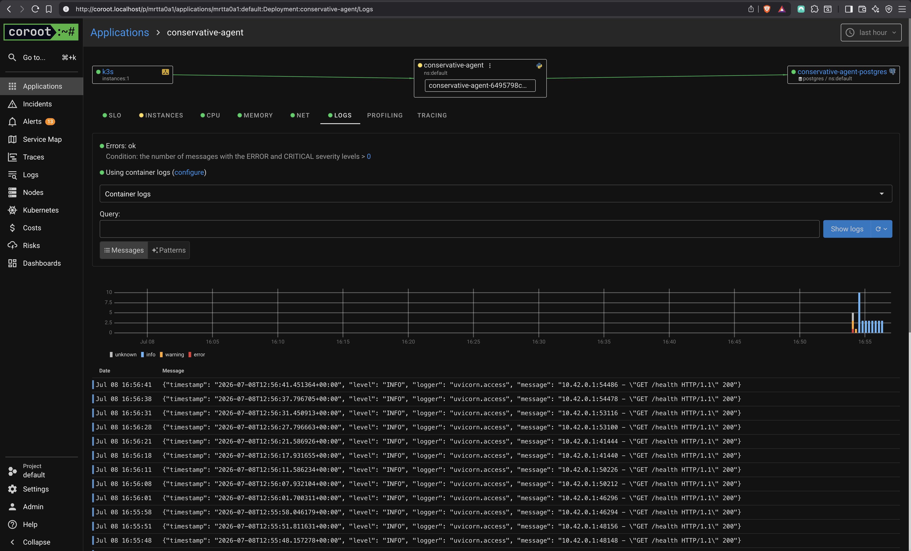

# 🐙 Octonaut

A minimal AI trading agent (`agent/`) and the Kubernetes operator that
deploys it (`operator/`). Fictional use case: a single always-on agent that
trades one ticker under one strategy (DCA / GRID / TWAP) in Kraken's paper
mode, reasoning with an LLM over live market data and its own trade memory,
never placing an order the LLM proposes without a deterministic solvency
check in between.

Two independent, separately-deployable pieces:

- **`agent/`** — the trading agent itself. Runs standalone with three env
  vars; no Kubernetes required.
- **`operator/`** — a [kopf](https://kopf.readthedocs.io/)-based operator
  that reconciles a `TradingAgent` custom resource into a running agent
  (Deployment, Service, ConfigMap, optional Ingress, and a default
  Postgres+pgvector instance if you don't bring your own).

## Architecture

```
┌─────────────────── agent pod ────────────────────┐
│ FastAPI (health/trades/positions/metrics)        │
│  + APScheduler tick -> runner.run_once           │
│                                                  │
│  runner.run_once:                                │
│   ensure_paper -> load_skills (deterministic:    │
│   Core + Market Data + strategy-type skill)      │
│   -> recall trade memory (pgvector, semantic)    │
│   -> graph.build_graph (LangGraph):              │
│        gather (kraken ticker/status/balance)     │
│        -> reason (OpenRouter LLM, ReAct agent    │
│           w/ read-only ticker/ohlc tools)        │
│        -> solvency guard (deterministic, no LLM) │
│        -> execute (kraken paper buy/sell)        │
│   -> persist Trade (ledger) + TradeMemory (RAG)  │
└──────────┬───────────────────────────────────────┘
           │ DATABASE_URL (postgres+pgvector: ledger + trade memory)
           │ OPENROUTER_* (LLM)
           │ LANGFUSE_* (optional: traces)
           ▼
     kraken CLI (subprocess, paper mode) · Postgres
```

**Safety invariant:** the order-placement tool is only ever called by the
deterministic `execute` step, never by the LLM. The LLM can propose a trade
(action/size/rationale); a pure `solvency_guard` function (balance vs. cost,
held size vs. sell size) is the sole gate before anything is placed. "Never
use leverage" is enforced structurally — no leverage/margin tool exists for
the LLM to call, spot paper trading only.

## Getting started

Everything below runs on a laptop, entirely local — no cloud account, no
registry, no manual signup for anything.

### 1. Install Lima

```bash
brew install lima
limactl --version
```

### 2. Start the instance

`octonaut.yaml` is a self-contained Lima config — a fresh k3s + ArgoCD stack,
independent of any other cluster. No manual image loading: two systemd units
(`build-agent`/`build-operator`) watch `agent/` and `operator/` and
rebuild+import each image on every save.

```bash
limactl start --name octonaut --param pwd=$(pwd) ./octonaut.yaml
```

Give it a couple of minutes for k3s, ArgoCD, and the first image builds to
settle, then point `kubectl` at it:

```bash
export KUBECONFIG=$(limactl list octonaut --format 'unix://{{.Dir}}/copied-from-guest/kubeconfig.yaml')
kubectl get application -n argocd   # all should show Synced/Healthy
```

Three UIs come up on `*.localhost` (Traefik ingress, no `/etc/hosts` edits
needed on macOS): `argocd.localhost`, `coroot.localhost`, `langfuse.localhost`.

### 3. Get the ArgoCD password

```bash
kubectl -n argocd get secret argocd-initial-admin-secret -o jsonpath="{.data.password}" | base64 -d; echo
```

Open `http://argocd.localhost`, log in as `admin` with that password. Only
the operator itself is ArgoCD-managed (`clusters/dev/apps/
octonaut-operator.yaml`) — everything else you see here (`coroot`, `langfuse`,
`kube-state-metrics`) is bootstrap infrastructure. All six apps should be
Synced/Healthy within a couple of minutes of cluster start:



### 4. Create the secret with your OpenRouter key

The only credential you need to supply — everything else (Langfuse's org,
project, user, and API keys) is generated automatically during provisioning
by `scripts/langfuse-secrets`, no signup or UI clicking required.

```bash
kubectl create secret generic octonaut-secret \
  --from-literal=openrouter-key=$OPENROUTER_API_KEY \
  --namespace default
```

### 5. Deploy the agents

`TradingAgent` CRs are applied by hand, not GitOps'd — this keeps ArgoCD
scoped to the platform (the operator), not every trading strategy someone
spins up. Three examples ship ready to go:

| Example | Strategy | Ticker | Posture |
|---|---|---|---|
| `conservative.yaml` | DCA | BTCUSD | small, regular buys; skip rather than chase |
| `moderate.yaml` | GRID | ETHUSD | grid around current price, moderate drawdown tolerance |
| `aggressive.yaml` | TWAP | SOLUSD | momentum-aware execution, tolerates overpaying into a spike |

```bash
kubectl apply -f clusters/dev/agents/
kubectl get tradingagent -n default
kubectl get pods -n default
```

Each provisions its own default Postgres+pgvector (none of the examples set
`spec.postgres`). The CRD's `ingress` / `resources` / `langfuse` / `postgres`
fields are all optional — see the commented-out examples in each file.

### 6. Log in to Langfuse

Retrieve the generated login:

```bash
kubectl get secret langfuse-secrets -n langfuse -o jsonpath='{.data.init-user-email}' | base64 -d; echo
kubectl get secret langfuse-secrets -n langfuse -o jsonpath='{.data.init-user-password}' | base64 -d; echo
```

Open `http://langfuse.localhost` and log in. After a few minutes, you'll see live traces from all three agents on the Home dashboard:



Click into any trace to see the full reasoning graph — `gather` → `reason`
(the ReAct loop, tool calls and all) → `guard` → `execute`, matching the
Architecture diagram above:



### 7. Log in to Coroot

Open `http://coroot.localhost` — create the admin user. The Service Map shows
the whole cluster's topology, agents included:



Click into any agent for its logs, metrics, and traces:



### 8. Running the agent standalone

No Kubernetes needed — just the `kraken` CLI on `PATH`
([install](https://github.com/krakenfx/kraken-cli)) and a reachable Postgres
with the `vector` extension (`pgvector/pgvector:pg17` works).

Required env vars: `OPENROUTER_MODEL`, `OPENROUTER_API_KEY`, `DATABASE_URL`.
Optional (all three together enable Langfuse tracing): `LANGFUSE_ADDRESS`,
`LANGFUSE_PUBLIC_KEY`, `LANGFUSE_SECRET_KEY`. Also: `AGENT_CONFIG` (default
`/etc/agent/config.yaml`), `AGENT_TICK_SECONDS` (default `300`).

`config.yaml`:

```yaml
strategy:
  type: GRID       # DCA | GRID | TWAP
  ticker: BTCUSD
  balance: 50000   # starting paper balance, passed to `kraken paper init --balance`
  prompt: |
    Trade BTC/USD conservatively.
    Require strong confirmation before entering.
    Never use leverage.
logging:
  level: INFO
  format: json      # or text
```

```bash
cd agent
uv sync
AGENT_CONFIG=./config.yaml \
DATABASE_URL=postgresql+psycopg://postgres:pw@localhost:55433/postgres \
OPENROUTER_MODEL=openai/gpt-4o-mini \
OPENROUTER_API_KEY=sk-... \
uv run python -m agent.main
```

`GET /health`, `GET /trades`, `GET /positions`, `GET /metrics` on `:8000`.
`SIGTERM` (e.g. `kubectl delete pod`, or Ctrl-C) cancels every open paper
order before the process exits.

Not using `octonaut.yaml`? Install the operator on any existing cluster by
hand (build/push `octonaut-agent`/`octonaut-operator` images to wherever your
cluster can pull from first), then apply the CRD, RBAC, and operator
Deployment directly:

```bash
kubectl apply -f operator/deploy/crd.yaml
kubectl apply -f operator/deploy/rbac.yaml
kubectl apply -f operator/deploy/operator-deployment.yaml   # set AGENT_IMAGE first
```

### 9. Running tests

```bash
cd agent && uv run pytest        # 69 tests; DB-backed tests need a reachable
                                    # Postgres+pgvector (TEST_DATABASE_URL env,
                                    # defaults to localhost:55433) or they skip
cd operator && uv run pytest     # 40 tests; all pure/fake-client, no cluster
```

## Operations

### Environment separation

Two environments, same GitOps pattern (`app-of-apps` Application per
cluster, `automated: {prune, selfHeal}` everywhere):

- **`clusters/dev`** — Lima k3s. ArgoCD syncs from `file:///opt/octonaut`
  (mounted via `clusters/dev/patch.yaml`), `*.localhost`.
- **`clusters/prod`** — ArgoCD syncs from `https://github.com/guigo2k/octonaut`,
  `*.octonaut.orphic.sh`.

`operator/deploy` (CRD, RBAC, operator Deployment) is shared: dev uses it as
a plain manifest directory, prod overlays it with Kustomize to swap in
`ghcr.io` images and flip `NETWORK_POLICY_ENABLED` on.

`TradingAgent` CRs are `kubectl apply`-only in both environments, never
GitOps'd (see Design decisions).

### Runtime configuration and secret handling

Two channels per agent: a ConfigMap for non-secret config (`strategy`, fixed
`logging`), and env vars for credentials — always via `secretKeyRef`,
enforced by the CRD schema, never inlined.

Two Secret tiers:

- **User-supplied:** `octonaut-secret` (OpenRouter key, created by hand) and
  `langfuse-secrets` (auto-generated in dev by `scripts/langfuse-secrets`).
- **Operator-provisioned:** the default Postgres password, generated once
  and reused across reconciles so it never rotates under a live connection.

No secret value ever appears in operator logs, CR status, or the ConfigMap.

### Ingress/egress and network security

Traefik is the single ingress point in both clusters; per-agent `Ingress` is
optional. Prod terminates TLS via cert-manager + Cloudflare's
`ClusterOriginIssuer` (`clusters/prod/apps/{cert-manager,origin-ca-issuer,tls}.yaml`)
— one Cloudflare Origin CA `Certificate` per hostname, referenced by
`secretName` from each Ingress/IngressRoute. Origin CA certs are only
trusted by Cloudflare's edge, so this assumes `octonaut.orphic.sh` is
proxied through Cloudflare (orange-clouded DNS) — grey-clouded/DNS-only
would need a standard ACME `ClusterIssuer` instead. Dev stays plain HTTP —
`*.localhost` never leaves the laptop.

The operator supports a default-deny `NetworkPolicy` per `TradingAgent`,
gated by `NETWORK_POLICY_ENABLED` (off in dev, on in prod via the Kustomize
overlay):

- **Egress:** DNS; outbound HTTPS for OpenRouter/Kraken (unscoped — those
  addresses aren't known to the operator); its own Postgres (pod-scoped
  when default-provisioned, port-only otherwise); Langfuse, if configured.
- **Ingress:** only from Traefik's namespace, only when `spec.ingress` is
  set.
- The default Postgres pod only accepts ingress from its own agent.

### Observability

Today: Coroot (zero-instrumentation service map/logs/metrics/traces) and
Langfuse (full LLM trace per tick: `gather` → `reason` → `guard` →
`execute`). Every agent exposes `/health`, `/trades`, `/positions`,
`/metrics`. None of this pages anyone yet.

Should alert on: agent liveness/readiness failures, reasoning-step
exceptions, rising solvency-guard rejections, LLM latency/error rate,
default-Postgres disk usage, ArgoCD sync/health status.

Should log: every trade decision (rationale, guard verdict, execute
result — already structured JSON), plus every order the SIGTERM handler
cancels.

### Capacity, rollout, rollback, and failure modes

**Capacity:** `TradingAgent` is single-replica by design (no HPA) — one
always-on agent per strategy, not a scalable service. More capacity means
more CRs, not more replicas. The operator is also single-replica (no leader
election).

**Rollout:** every merge to `main` auto-syncs via ArgoCD. CI publishes
images on push to `main` (`latest` + `sha-<short>`), but the operator only
re-renders on a CR's own create/update/resume — a new image doesn't trigger
a rollout by itself; pin `sha-<short>` and re-apply the CR to roll one out
deliberately.

**Rollback:** no automated path. GitOps resources roll back via `git
revert`; hand-applied `TradingAgent` CRs have no history — rollback means
re-applying an older CR.

**Failure modes:**

- *Operator down:* existing agents keep running; nothing new reconciles
  until it's back.
- *Agent crash:* SIGTERM handler cancels open orders before SIGKILL; state
  persists in Postgres, so the agent resumes rather than starting blind.
- *Default Postgres loss:* single replica, no backup — real data-loss
  exposure today.
- *OpenRouter outage:* the `reason` step fails; no retry/alerting yet.
- *Solvency guard:* can't fail open — a pure function gating every trade
  regardless of the LLM's output.

## Design decisions & simplifications

- **RAG is deterministic for skills, semantic only for trade memory.** Core +
  Market Data + the one strategy-type skill are a fixed lookup by
  `strategy.type` (there's nothing to embed — selection is already 1:1).
  pgvector is used only to recall past trade rationales by similarity, the
  one place free-text search actually helps.
- **Local embeddings** (`fastembed`, `BAAI/bge-small-en-v1.5`, baked into the
  Docker image at build time, `HF_HUB_OFFLINE=1` at runtime) rather than a
  second required API key — OpenRouter doesn't serve embeddings.
- **No deterministic risk-preset subsystem.** Nothing in the config or CRD
  schema calls for one; safety is structural (no leverage tool exists) plus
  one inline solvency check, not a configurable constraint matrix.
- **No Alembic.** One small schema, idempotent `CREATE TABLE IF NOT EXISTS`
  at startup (`agent.db.init_db`) instead of migration tooling.
- **One fixed tick interval**, not per-strategy cron — the config has no
  schedule field; the strategy-type skill + prompt encode DCA/GRID/TWAP
  *behavior*, not cadence.
- **kopf over Kubebuilder/client-go** for the operator — same language as the
  agent, smallest footprint for a "simple operator." The operator itself is
  ArgoCD-managed (`clusters/dev/apps/octonaut-operator.yaml`, plain-directory
  source over `operator/deploy/`); individual `TradingAgent` CRs are
  deliberately kept `kubectl apply`-only — GitOps for the platform, not for
  every trading strategy someone spins up.
- **Standard `networking.k8s.io/v1` Ingress**, not a Traefik-specific
  `IngressRoute` — the CRD's `ingress.className/host/path/tls` fields are
  generic, so the operator renders a portable resource.

## Known gaps / what I'd do with more time

- **Reasoning quality** is observed via Langfuse traces, not unit-asserted —
  same tradeoff the reference agent made; a small eval harness would be a
  good next step.
- **Multi-strategy / multiple tickers per agent** — intentionally out of
  scope; the config and CRD are both single-strategy by design here.
- **GitOps for TradingAgent CRs.** Only the operator is ArgoCD-managed;
  individual CRs stay `kubectl apply`-only by design (see above) — an
  `ApplicationSet` per-CR would be the natural extension if that's wanted.
- **Operator status detail.** `status.phase` is set to `Running` once
  resources are applied, not once the agent Pod is actually healthy — a
  proper implementation would watch the child Deployment's rollout status.
- **Coroot as the only observability backend.** Great for a
  zero-instrumentation demo, but a real production stack would swap it for
  Grafana + VictoriaMetrics (metrics) + Loki (logs) + Tempo (traces) —
  more moving parts, but purpose-built, widely-adopted components instead
  of one opinionated all-in-one tool.
